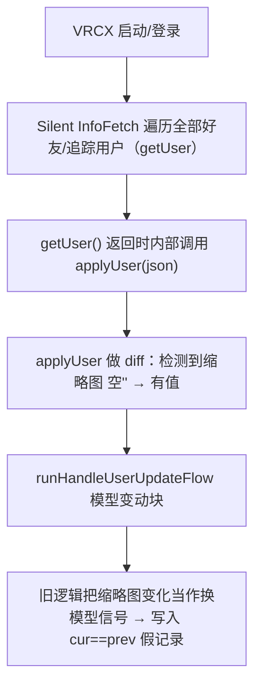

# feed_avatar 假"模型变动"记录 —— 根因分析

> 结论先行：不是好友换了模型，也不是数据库/缓存数据损坏，而是 **VRCX 用"缩略图"当换模型判据** 的缺陷，叠加 VRChat 批量好友接口对**离线好友不给缩略图** 的数据差异，导致每次启动都会误写一条 `cur == prev`（同一模型）的假记录。

---

## 1. 现象

- 数据库 `feed_avatar` 出现大量 `current_avatar_image_url == previous_current_avatar_image_url`（同一模型图被记录成"变动"）的记录。
- **每次启动/登录 VRCX 都会新增一条**，集中在某位好友身上（下文称"该好友"）。
- UI 上看起来像"（空的/什么都没有）→ 超小小奶頭貓"，像一次从"无模型"到"有模型"的真实切换。

## 2. 假记录的"真实"存储值

以 2026-08-10 的一条为例（`id=138287`）：

| 字段 | 值 |
|---|---|
| `current_avatar_image_url`（当前模型图） | `file_2fcee038...`（超小小奶頭貓） |
| `previous_current_avatar_image_url`（上一个模型图） | `file_2fcee038...`（**同一个，非空**） |
| `current_avatar_thumbnail_image_url`（当前缩略图） | `.../image/file_2fcee038.../1/256` |
| `previous_current_avatar_thumbnail_image_url`（上一个缩略图） | **空 `''`** |

**关键**：模型图从未变化（`prev == cur == 超小小奶頭貓`）。真正"从空变有值"的只有**缩略图**。

UI 里看起来像"空 → 超小小奶頭貓"，是因为 UI 渲染"上一个"时用的是**缩略图**；缩略图为空 → 显示成"无"。这给人"从无模型切换"的错觉，但模型图其实没变。

## 3. 触发链

关键代码链路：

- `src/coordinators/infoFetchCoordinator.js` → `runSilentInfoFetch()`：启动时对每个目标调用 `userRequest.getUser()`。
- `src/api/user.js` → `getUser()`：返回前调用 `applyUser(json)` —— 本意只是更新缓存，副作用是把 diff 分流到写 feed。
- `src/coordinators/userEventCoordinator.js` → `runHandleUserUpdateFlow()`：模型变动块把 **缩略图变化** 和 **currentAvatarTags 变化** 都当作换模型信号。

## 4. 为什么"上一个缩略图"是空（根因）

`src/api/friend.js` 的 `getFriends()` 把 `/auth/user/friends` 的响应**原样**喂给 `applyUser()`，不做任何缩略图处理。所以 ref 的缩略图是否为空，完全取决于 VRChat 批量接口返回什么。

完整数据流：

1. **启动**：`runInitFriendsListFlow()` → `refreshFriends()` → `getFriends('/auth/user/friends', offline=true)` 批量拉取好友列表。
2. **VRChat 批量接口对离线好友返回精简数据**：`currentAvatarImageUrl` 带了（好友离线前戴着已知模型），但 `currentAvatarThumbnailImageUrl` **为空/缺失**。
3. `applyUser(friend)` 据此建立 ref：**图片有、缩略图为空**。
4. 随后 `runSilentInfoFetch()` 的 **单查接口** `getUser('/users/{id}')` 返回**完整缩略图**（该模型在 VRChat 中确实有缩略图）。
5. diff 检测到缩略图 `'' → url`，被旧逻辑误判为换模型 → 写入 `cur==prev` 假记录。

> 一句话：**VRChat 批量好友接口（离线好友）不返回缩略图，单查接口返回；VRCX 把"缩略图从空变有值"误当成换模型。**

### 4.1 实测验证（真实调用 VRChat API）

用当前账号的真实令牌，对同一好友（Kemomimi Yuki，`location: offline`）分别请求两个接口：

| 接口 | `currentAvatarImageUrl` | `currentAvatarThumbnailImageUrl` |
|---|---|---|
| `GET /auth/user/friends?offline=true`（批量） | ✅ `file_2fcee038...`（超小小奶頭貓） | ❌ **`null`（空/缺失）** |
| `GET /users/{id}`（单查） | ✅ `file_2fcee038...`（超小小奶頭貓） | ✅ `.../image/file_2fcee038.../1/256` |

**结论**：这是 **VRChat API 本身的行为**——批量好友列表接口对离线好友省略 `currentAvatarThumbnailImageUrl`，单查接口返回完整缩略图。空值来源于 VRChat 服务端数据差异，与 VRCX、本地缓存、模型本身都无关。

## 5. 为什么只有这位好友触发

触发需要同时满足：

1. 好友在 VRCX 启动时处于**离线**状态（在线好友由 websocket 拿到完整数据，ref 缩略图不空，不会误判）；
2. 该好友 ref 的**模型图非空**（离线前戴着已知模型），否则写库门槛 `logEmptyAvatars || ref.currentAvatarImageUrl` 直接不过；
3. InfoFetch 的单查接口随后补全了缩略图。

这位好友（08-09 20:36 下线、下线前戴着超小小奶頭貓）恰好**长期稳定满足以上条件**，所以每次启动都中招。其他离线好友要么模型图也是空（门槛不过），要么不是这种"图片有、缩略图空"的组合；在线好友则拿到完整数据、ref 无缺口。

## 6. 结论与修复方向

- **不是模型问题**：超小小奶頭貓（`file_2fcee038`）本身正常，VRChat 里有完整缩略图。
- **不是缓存/数据库损坏**：数据库忠实存了错误逻辑塞进来的值。
- **真正的缺陷**：VRCX 用 **缩略图**（对离线好友是不可靠的弱信号）当作换模型判据，而**模型图片 URL**（离线好友也可靠、且是模型真正身份）反而没有作为判据。
- **修复方向**：以**模型图片 URL** 作为换模型的判据（图片变了才算换模型，缩略图/标签单独变化不算），而不是在写库处加守卫兜底。

---

*文档日期：2026-08-10 · 关联 PR：#24*
